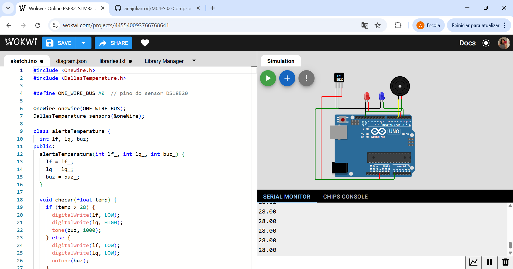

# M04-S02-Comp-ponderada3
# Sistema de Monitoramento de Temperatura

Este projeto implementa um sistema de monitoramento de temperatura utilizando Arduino que emite alertas visuais e sonoros quando a temperatura ultrapassa um limite predefinido.

## Componentes Utilizados

- 1x Arduino UNO R3
- 1x Sensor de temperatura DS18B20
- 2x LEDs (para indicação visual)
- 1x Buzzer (para alerta sonoro)
- 3x Resistores (para LEDs e pull-up do sensor)
- 1x Protoboard
- Jumpers para conexões

## Conexões

- Sensor DS18B20: Conectado ao pino analógico A0
- LED 1 (Indicador): Conectado ao pino digital 2
- LED 2 (Alerta): Conectado ao pino digital 3
- Buzzer: Conectado ao pino digital 4

## Funcionamento

O sistema realiza as seguintes operações:

1. Faz leituras contínuas da temperatura através do sensor DS18B20
2. Quando a temperatura excede 28°C:
   - Ativa o LED de alerta
   - Aciona o buzzer com frequência de 1000Hz
3. Quando a temperatura está abaixo de 28°C:
   - Mantém os LEDs desligados
   - Mantém o buzzer desligado
4. As leituras de temperatura são enviadas pela porta serial (9600 baud)

## Bibliotecas Utilizadas

- OneWire: Para comunicação com o sensor DS18B20
- DallasTemperature: Para leitura do sensor de temperatura

## Estrutura do Código

O código utiliza programação orientada a objetos com a classe `alertaTemperatura` que encapsula a lógica de controle dos alertas baseados na temperatura.

## Circuito

## Como Utilizar

1. Monte o circuito conforme a imagem acima
2. Carregue o código para o Arduino
3. Abra o monitor serial para visualizar as leituras de temperatura
4. O sistema começará a monitorar a temperatura automaticamente

## Observações

- O sistema foi configurado para um limiar de 28°C
- As leituras são realizadas a cada 1 segundo
- Certifique-se de que as conexões estão corretas para evitar danos aos componentes